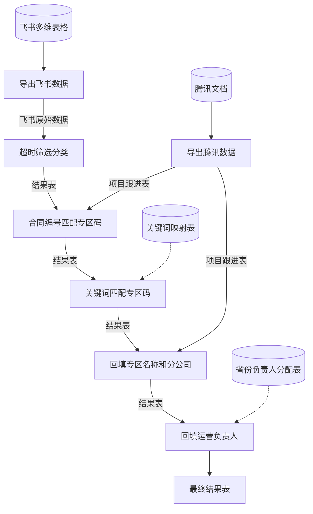

# 需求数据处理流程

## 整体说明

整个流程由 openclaw 调用 `workflow.py`，依次完成数据导出、清洗分析、专区码匹配、信息回填等步骤，最终输出一份带超时标记和完整专区信息的结果表。

**设计思路：** 整个分析流程是固定的，每一步做什么、怎么判断都是确定的逻辑，不需要每次都让 AI 来理解和执行。所以把这些固定的处理过程保存为 Python 脚本，结合 openclaw 的 skill 功能来调用执行，再配合 openclaw 的定时任务实现全自动定时导出和分析。这样做的好处是：一是节省 token，不需要每次都把大量数据交给 AI 去分析处理；二是保证分析过程的稳定，脚本跑出来的结果是确定的，不会因为 AI 理解偏差导致结果不一致。

---

## 各步骤详细说明

### 步骤 1：导出飞书原始数据

- **脚本：** `export_feishu.py`
- **做的事：** 用 Playwright 打开飞书多维表格，自动导出 Excel 文件
- **产出数据：** 飞书原始数据（包含所有需求的原始记录，字段有需求编号、需求名称、合同编号、登记日期、需求评审状态、开发状态等）

### 步骤 2：导出腾讯文档（项目跟进表）

- **脚本：** `export_tencent.py`
- **做的事：** 用 Playwright 打开腾讯文档的在线表格，自动导出 Excel 文件
- **产出数据：** 项目跟进表（包含"专区管控表"工作表，记录了合同编号、专区码、专区名称、分公司等映射关系）

### 步骤 3：数据清洗与超时分类

- **脚本：** `exportDataHandle.py`
- **输入数据：** 飞书原始数据
- **做的事：**
  1. 读取原始数据，去掉没有登记日期的行
  2. 按三种超时规则筛选需求：
     - 评审超时：登记超过 5 个工作日或 7 个自然日，且还停留在需求设计/规划评审/等待分配阶段
     - 开发超时：评审完成但开发中超过 10 个工作日
     - 上线超期：评审完成超过 15 个工作日，但开发状态还没走到终态
  3. 三类结果分别写入三个工作表
- **产出数据：** 结果表（包含三个工作表：1_评审超时、2_开发超时、3_上线超期）

### 步骤 4.1：通过合同编号匹配专区码

- **脚本：** `contractMatch.py`
- **输入数据：** 结果表 + 项目跟进表
- **做的事：**
  1. 从项目跟进表的"专区管控表"中读取合同编号与专区码的对应关系
  2. 遍历结果表的每一行，如果专区码为空，就拿合同编号去管控表里查找（包含匹配）
  3. 匹配到就填入专区码
- **产出数据：** 回写到结果表，补上一部分专区码

### 步骤 4.2：通过关键词匹配专区码（兜底）

- **脚本：** `keywordMatch.py`
- **输入数据：** 结果表 + 关键词映射表
- **做的事：**
  1. 读取关键词映射表，建立"关键词 → 专区码"的字典
  2. 遍历结果表中专区码仍然为空的行，拿需求名称去匹配关键词
  3. 需求名称中包含某个关键词，就填入对应的专区码
- **产出数据：** 继续回写到结果表，再补上一批专区码

### 步骤 5：专区名称及分公司信息回填

- **脚本：** `zoneBackfill.py`
- **输入数据：** 结果表 + 项目跟进表
- **做的事：**
  1. 从项目跟进表中建立"专区码 → (专区名称, 分公司)"的映射
  2. 有专区码的行：直接用专区码查出专区名称和分公司，覆盖写入
  3. 没有专区码的行：检查当前填的专区名称是否合法，不合法的就清空
  4. 把"专区码"列调整到第二列的位置
- **产出数据：** 回写到结果表，补上专区名称和分公司

### 步骤 6：运营负责人回填

- **脚本：** `personMatch.py`
- **输入数据：** 结果表 + 省份负责人分配表
- **做的事：**
  1. 从分配表中读取"省份 → 负责人"的映射关系
  2. 遍历结果表，根据"分公司"列的值查出对应的运营负责人
  3. 把负责人填入新列，并调整到紧跟分公司后面的位置
- **产出数据：** 最终版结果表（带完整的专区码、专区名称、分公司、运营负责人）

---

## 流程图

## 涉及的数据文件汇总

| 文件 | 来源 | 用途 |
|------|------|------|
| 飞书原始数据 | 步骤1自动导出 | 需求的原始数据，作为分析的输入源 |
| 项目跟进表 | 步骤2自动导出 | 专区管控表，提供合同编号↔专区码↔专区名称↔分公司的映射 |
| 关键词映射表 | 手动维护 | 关键词到专区码的补充映射，用于合同编号匹配不上的兜底场景 |
| 省份负责人分配表 | 手动维护 | 省份/分公司到运营负责人的映射 |
| 结果表 | 步骤3~6逐步完善 | 最终输出，包含超时需求清单及完整的专区和负责人信息 |
